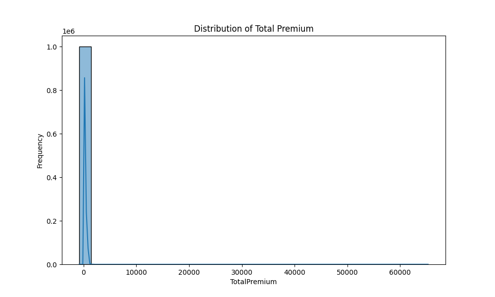
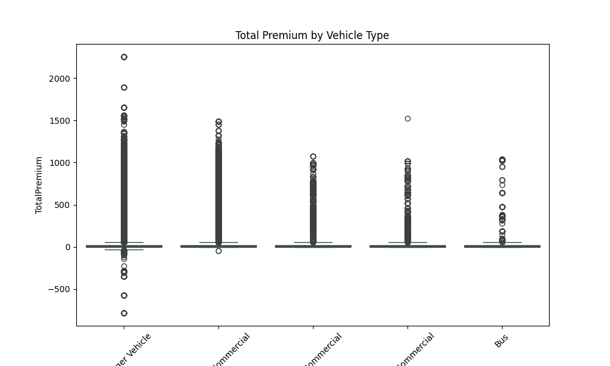
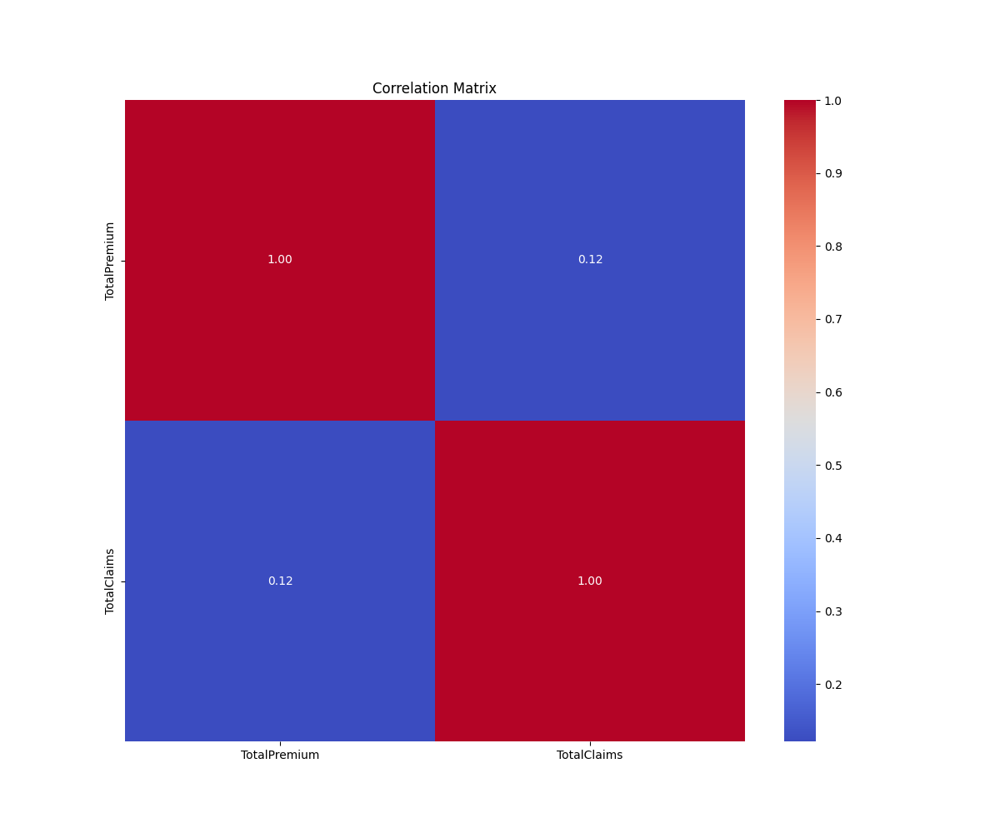

# Interim Report: Insurance Risk & Predictive Analytics

**To:** AlphaCare Insurance Solutions (ACIS) Data Analytics Team
**From:** Marketing Analytics Engineer
**Date:** December 7, 2025

---

## 1. Executive Summary

This report summarizes the progress made in the initial phase of the Car Insurance Risk Analysis project. The primary goal is to establish a robust data analytics framework to identify "low-risk" clients for premium optimization. To date, we have successfully implemented a Data Version Control (DVC) system, completed a comprehensive Exploratory Data Analysis (EDA) of historical claim data, and established an automated Continuous Integration (CI) pipeline. These foundational steps ensure data integrity and code reliability for the upcoming predictive modeling phases.

## 2. Business Objective & Context

AlphaCare Insurance Solutions (ACIS) is committed to leveraging data-driven insights to refine its marketing strategy and improve profitability. The key challenge lies in accurately segmenting the customer base to identify low-risk individuals who qualify for reduced premiums. This strategy aims to:
*   **Attract New Clients:** Competitive pricing for safe drivers.
*   **Optimize Marketing:** Target campaigns towards favorable risk profiles.
*   **Reduce Loss Ratios:** Minimize high-risk exposure through better prediction.

The work completed in this phase lays the groundwork for these strategic goals by ensuring the data quality and analytical infrastructure are sound.

## 3. Completed Work

### Task 1: Exploratory Data Analysis (EDA)
We have developed a modular Python codebase to ingest and analyze the `MachineLearningRating_v3.txt` dataset.
*   **Modular Implementation**: The monolithic analysis approach was refactored into reusable modules:
    *   `src/loader.py`: Handles data ingestion with support for multiple delimiters.
    *   `src/eda.py`: Performs statistical summarization, missing value checks, and outlier detection using the detailed IQR method.
    *   `src/visualization.py`: Generates standardized plots for risk assessment.
*   **Findings**: Initial analysis revealed significant variance in `TotalPremium` and `TotalClaims`, with clear outliers that need to be addressed in the modeling phase.

### Task 2: Data Version Control (DVC)
To manage the large dataset (approx. 500MB) responsibly:
*   **Setup**: DVC was initialized to track raw data, keeping the git repository lightweight.
*   **Remote Storage**: A local remote (`C:/dvc-storage`) was configured to simulate a production-grade object storage environment.
*   **Outcome**: Data is now versioned alongside code, ensuring full reproducibility of the analysis.

### Infrastructure & CI/CD
*   **Git Best Practices**: We utilized a feature-branch workflow (`task-1`, `task-2`) to isolate changes.
*   **Automated Testing**: A GitHub Actions workflow (`unittests.yml`) now runs `pytest` on every commit, validating the integrity of our data processing logic.

## 4. Visualizations & Analysis

The following plots highlight key trends in the insurance data:

### 4.1. Distribution of Total Premium

*Figure 1: Histogram of Total Premium. The distribution shows a skew towards lower premium amounts, with a long tail indicating a small number of high-value policies. This suggests that most clients fall into the standard premium range.*

### 4.2. Premium vs. Vehicle Type

*Figure 2: Boxplot of Total Premium by Vehicle Type. This visualization reveals that certain vehicle classes (e.g., Trucks) exhibit higher median premiums and variability compared to standard passenger cars, correlating with higher expected risk.*

### 4.3. Feature Correlation

*Figure 3: Correlation Matrix of numerical features. We observe a positive correlation between `TotalPremium` and `TotalClaims`, validating the assumption that higher premiums generally track with higher claim costs, though the relationship is not perfectly linear.*

## 5. Next Steps

With the foundation established, the next project phases will focus on:

*   **Task 3: Statistical Hypothesis Testing**:
    *   Validate if there are statistically significant differences in risk (Claims) across gender and provinces.
    *   Test the impact of `ZipCode` on premium variations.
*   **Task 4: Predictive Modeling**:
    *   Engineer features such as `ClaimsRatio` and `VehicleAge`.
    *   Train machine learning models (XGBoost, Linear Regression) to predict `TotalClaims`.
    *   Evaluate model performance and define the "Low-Risk" score threshold.
*   **Validation**: Further investigate the outliers identified in the EDA phase to decide on capping or exclusion strategies.

---
*End of Interim Report*
